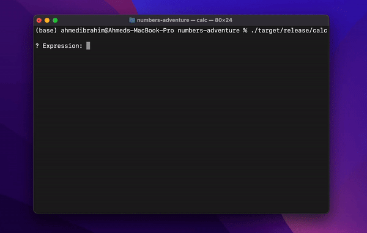
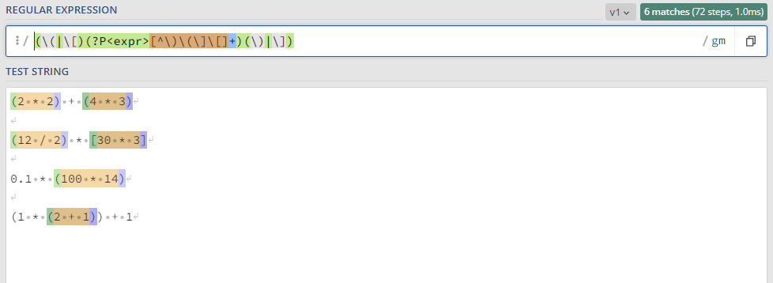

# Numbers Adventure

Calculator to perform basic arithmetic operations on raw expressions.

<p align="center">
    
<p>

## Preview

<p align="center">
    
<p>

## Examples

```bash
? Expression: (2 * 2) + (4 * 3)
#> 16
? Expression: (12 / 2) * [30 * 3]
#> 540
? Expression: 1.0 * 0.1
#> 0.1
? Expression: 0.1 * (100 * 14)
#> 140
? Expression: 0.1 / 20 + 14
#> 14.005
? Expression: (1 * (2 + 1)) + 1
#> 4
```

# How it works
we call the whole input an **experssion** (`expr` for short). Every `expr` might be made of combination of `terms`, `operators` and other `expr`.
For example take this input `1 + 2 [14 * (22 + 4)] + 7`. 

- `1 + 2 [14 * (22 + 4)] + 7` this is as whole called `expr`
- `1` is a `term`
- `+` is an operator
- `[14 * (22 + 4)]` another `expr`
- `(22 + 4)` another `expr`

Using this recursive relationship we can evaluate the `expr` in this manner 
```bash
Result (+)
├── 1
├── 2
├── [14 * (22 + 4)] (*)
│   ├── 14 
│   └── (22 + 4) (+)
│       ├── 22 
│       └── 4   
└── 7
```

I am using a combination of **recursion** and **regular expressions** to be able to perform **nested** operations.

at the core you will find this single `regexp`

```rs
let re = Regex::new(r"(\(|\[)(?P<expr>[^\)\(\]\[]+)(\)|\])").unwrap();
```

This regexp should match any nested experssion that is inside `()` or `[]` or both. It will match **_from inside out_** for example consider this experssion `[()()]` it will match `()` then `()` then the whole `[() ()]` experssion

I am sure if i tried to read this `regexp` on week from now I will not be able to do so! for this reason I am using interactive tool called [regexp101.com](https://regex101.com/r/Z8ELny/1) that make `regexp` easy to develop

if you follow [this link](https://regex101.com/r/Z8ELny/1) you should see this

<p align="center">
    
<p>

## Supported operations

```rs
enum Op {
    Plus, // '+'
    Mins, // '-'
    Multi, // '*' | 'x'
    Div, // '/'
}
```
